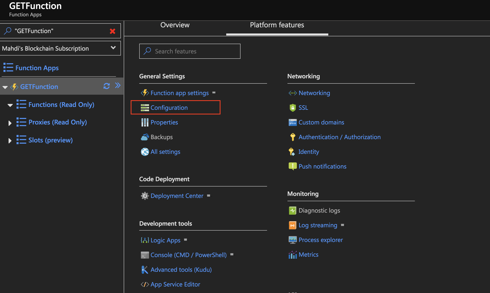
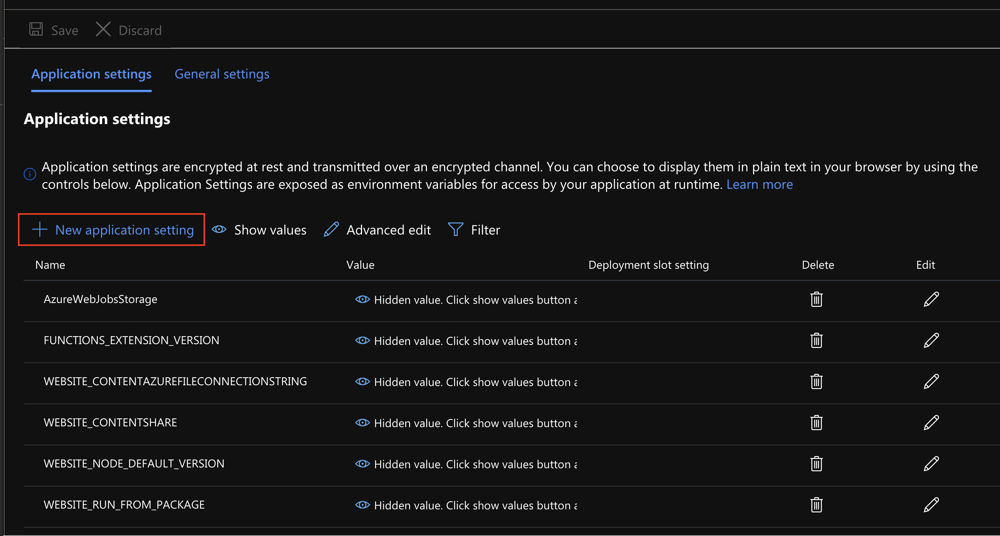
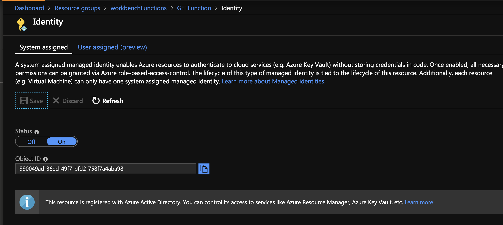
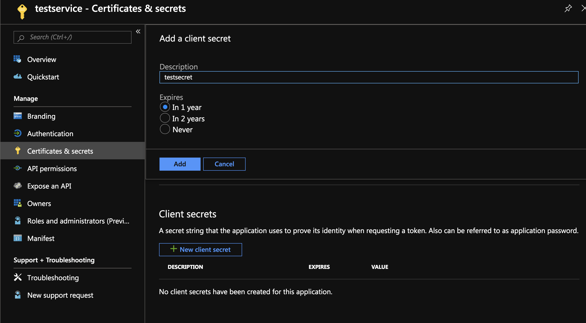
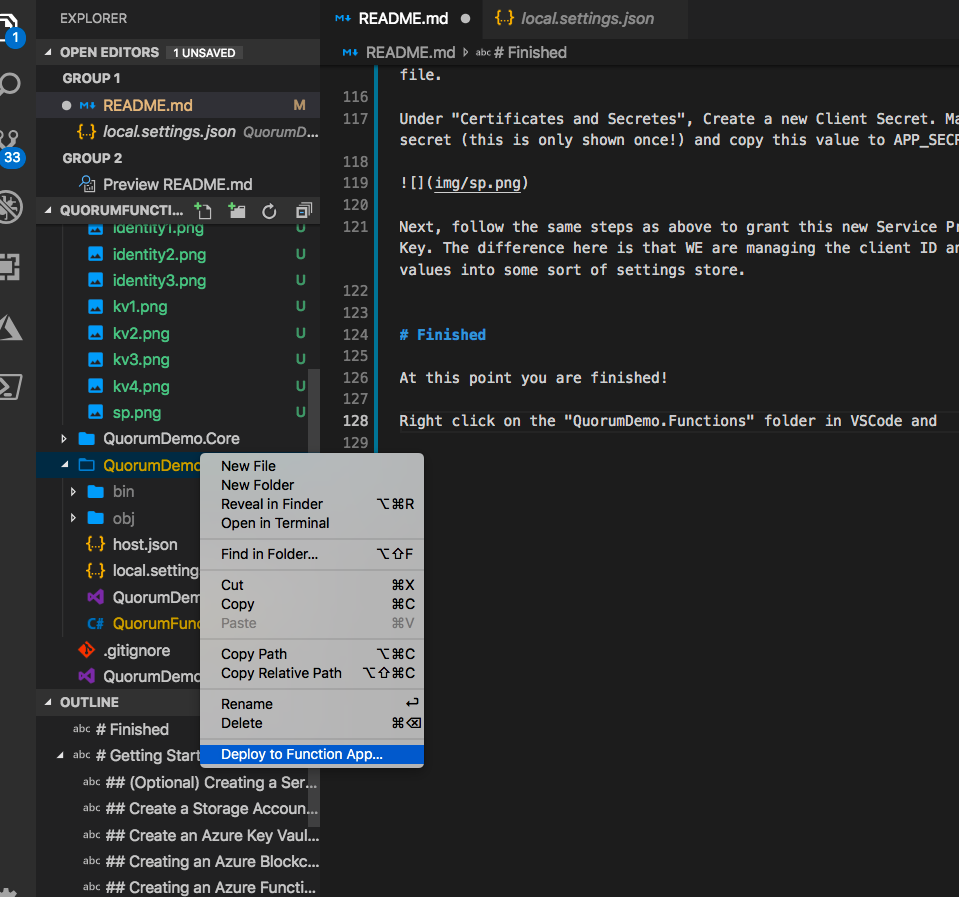
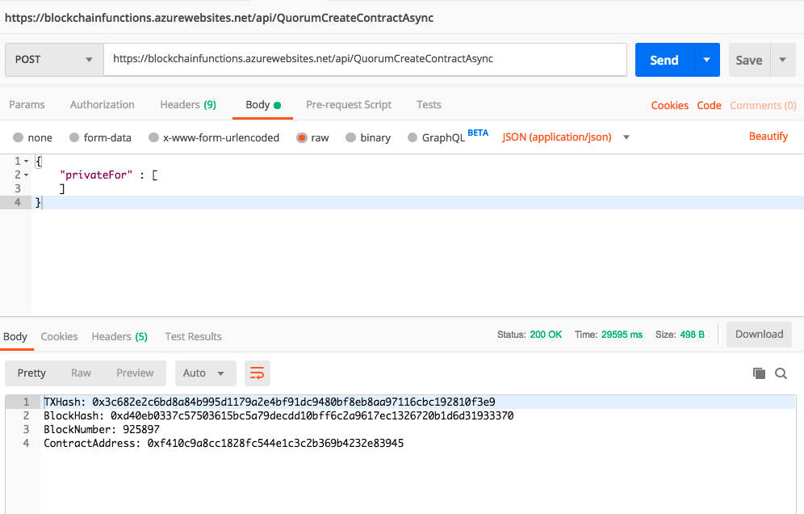
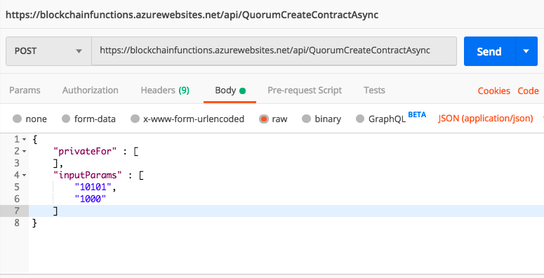
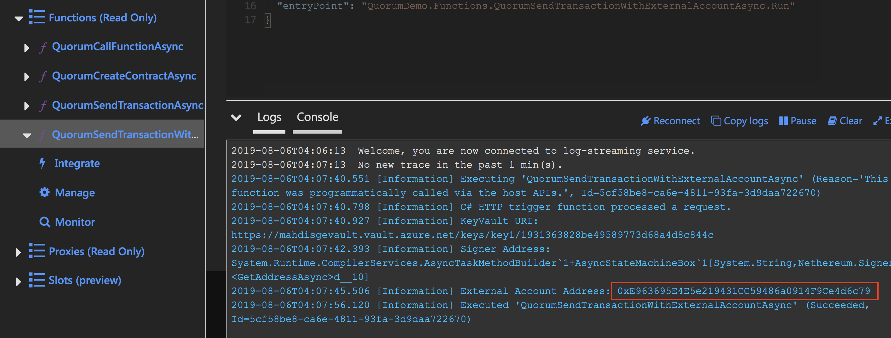
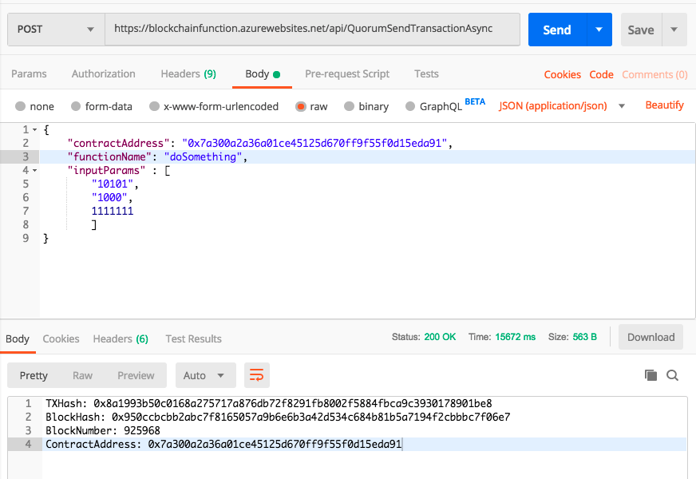

# Introduction 

## What is this sample? 
This project contains An Azure Function sample for use with Quorum on [Azure Blockchain Service](https://azure.microsoft.com/en-ca/services/blockchain-service/), or any other Ethereum RPC endpoint.

This sample is not meant for production use, it is a sample.

It demonstrates two important concepts that are important in Enterprise blockchain deployments 

1. Private Key being managed by an HSM (Azure Key Vault) with the signing operations being done IN the HSM, and the key not being accessible to the application. This is facilitated through [Nethereum.Signer.AzureKeyVault](https://www.nuget.org/packages/Nethereum.Signer.AzureKeyVault/)

2. Creating and calling smart contracts with Quorum and Nethereum, using the ExternalAccount object with a reference to our private key (or ethereum account) that is held in KeyVault

3. A project containing a "QuorumTransactionManager" helper class that handles deployment and calling smart contracts. The class contains methods that do a variety of things asynchronously. The class is meant to be generic in that it works for ANY smart contract, so long as you supply the appropriate parameters.

With this sample, we demonstrate a scenario where the details of the Private Key are stored securely in the cloud and we create our Ethereum account on the fly from the details of that key. 

## Project references:

The following nuget packages are referenced: 

- [Nethereum.Quorum](https://www.nuget.org/packages/Nethereum.Quorum/)
- [Nethereum.Accounts](https://www.nuget.org/packages/Nethereum.Accounts/)
- [Nethereum.Signer.AzureKeyVault](https://www.nuget.org/packages/Nethereum.Signer.AzureKeyVault/)
- [Polly.NET](https://www.nuget.org/packages/Polly/) for resilient APIs

## Prerequisites

This readme will not walk you through using Nethereum or setting up an Azure Blockchain service node. 

For Nethereum documentation please refer to: https://docs.nethereum.com/en/latest/

For setting up an Azure Blockchain service node please refer to: https://docs.microsoft.com/en-us/azure/blockchain/service/create-member

For setting up VSCode for use with Solidtity and Azure Functions, please download the extensions for Azure Functions and Solidity respectively. 

It is assumed that the people following this guide have a good understanding of Ethereum concepts (Contracts, functions, signing operations, nonces, submitting transactions via Web3, ect).

## What You Need to Run this Sample

This sample comes complete with a local.settings.json file that has a few Environment variables set. We really only need to set up 4 Azure services, and copy a few values to "local.settings.json"

1. An Azure Blockchain Service Node - so we have our RPC Endpoint
2. An Azure Key Vault to store our private Key 
3. A Blob storage account for storing the compiled smart contract's JSON file (that contains the bytecode and ABI)
4. An Azure Function for deploying this as a Function App
5. (Optional) A Service Principal for the KeyVault above so we can grab the key when deploying our function locally with an Application ID and associated Secret

# Getting Started

## Creating an Azure Blockchain Service Node 

Create a new Azure Blockchain Service node and make a note of the RPC Endpoint by going to Transaction Nodes -> Click on your Node -> Access Keys. Use this value for "RPC"

## Create an Azure Key Vault and a Private Key

Create an Azure KeyVault and skip the steps pertaining to Access Policies and Virtual Network: 

Click on Keys, then, Generate An Elliptic Curve Key using the SECP256K1 Curve:

Next, Grab the URL of the above Key and paste it into the value for "KEYVAULT_PRIVATEKEY_URI"

## Create a Storage Account to hold our Smart Contract JSON file

Create a storage account and create a container within "Blobs" that has anonymous read access for blobs:

Upload the JSON file to the blob container. For an example JSON file generated from a contract compilation (SimpleStorage) please take a look here: https://mahdiattachments.blob.core.windows.net/attachments/SimpleStorage.json

## Creating an Azure Function App 

We will first set up our Azure Function within the Portal and create the Enivronment Variable values for it as well. 

Create an Azure Function (either consumption or AppService are fine). Once created go to **Platform Features** and then click on **Configuration** So you can add new Application Settings:

In this page, add EVERY SINGLE Application setting that you see in the "local.settings.json" file. These are the environment variables that will be used once the function source code is deployed. 

**DON'T FORGET TO CLICK SAVE AFTER YOU HAVE ADDED NEW SETTINGS**

Next, Lets enable Identity. On the "Platform Features" Tab, click Identity, then enable System Managed Identity. This step registers the Function with Azure Active Directory so that we can configure an access policy in our Key Vault to grant access to the Private Key. 

Take a note of the name of the Service Principal (GETFunction below) and the Object ID. We need this in the next step. 

## Grant the Function access to KeyVault

Go back to your KeyVault resource, and click on Access Policies -> Add Access Policy

Becase we only need access to the Key, use "Select All" under Key Permissions for simplicity. 

**NOTE:** In practice, don't grant the "Select All" Property, we really only need GET, LIST and SIGN operations, so if you'd like to keep it those three, please do that instead. 

Under "Select Principal", search for the name of the Principal that was created (GETFunction in this screenshot below). The Principal should pop up. If not, refresh the page and do the steps again: 

At this point we're done! Make sure your KeyVault policies are saved. You have now granted the Azure Function access to your KeyVault Key. 

We can use the URL to the Private Key and Functions will automatically grant access to it behnid the scenes. 

## (Optional) Creating a Service Principal for the Azure Function

In this step, we also create a NEW Service Principal that WE have access to. This step is required if we want to deploy the function locally as well. 

Go to your Azure Active Directory and click on "App Registrations". Create a New Registration. 

Make note of the Application (client) ID and copy this value to APP_ID in your local.settings.json file. 

Under "Certificates and Secretes", Create a new Client Secret. Make note of the **Value** of the secret (this is only shown once!) and copy this value to APP_SECRET in your local.settings.json file. 

Next, follow the same steps as above to grant this new Service Principal access to your KeyVault's Key. The difference here is that WE are managing the client ID and Secret and so we have to copy these values into some sort of settings store. 

# Finished 

At this point you are finished deploying all the necessary resources!

## Deploy the Function App to Azure: 

Right click on the "QuorumDemo.Functions" folder in VSCode and select "Deploy to Function App". Follow the on-screen steps and deploy the function to Azure Functions or Locally. 

You will have 3 Functions Available to call either locally or from your deployed function:

1. {baseURL}/api/QuorumCreateContractAsync

2. {baseURL}/api/QuorumSendTransactionAsync

3. {baseURL}/api/QuorumCallFunctionAsync

## Calling the Functions and an example Payload: 

To create a new Function, make a POST to the API with the following Body (if your Contract constructor expects input parameters, include them in the body as an array of OBJECTS). You can also provide PrivatFor paratmers as an array of strings. For more details, check out the QuorumTransactionInput Class. 

Send the Request and you should see a succesful response!

Also - if you check out the function logs you'll see in the output the Ethereum Account Address associated with the Private Key thats in KeyVault!

Below is an example of calling an existing contract using the "QuorumSendTransactionAsync" API: 

You have to supply the Contract Address, Function Name, and any Input parameters (as well as a privateFor list, if applicable)

## Thats it! I hope you enjoyed this sample!
